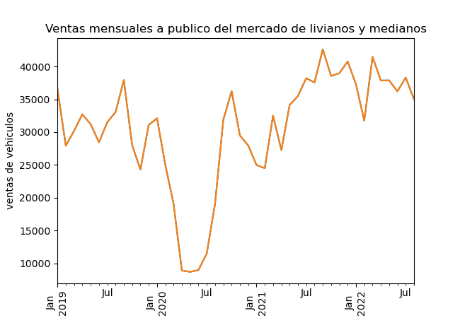
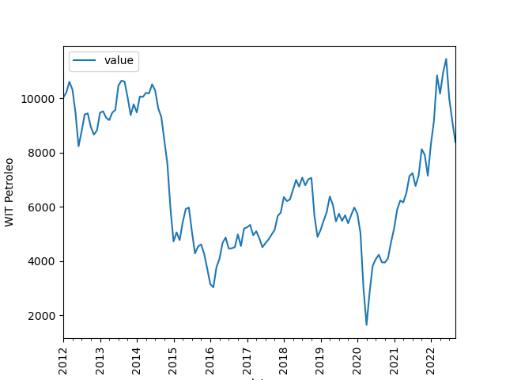
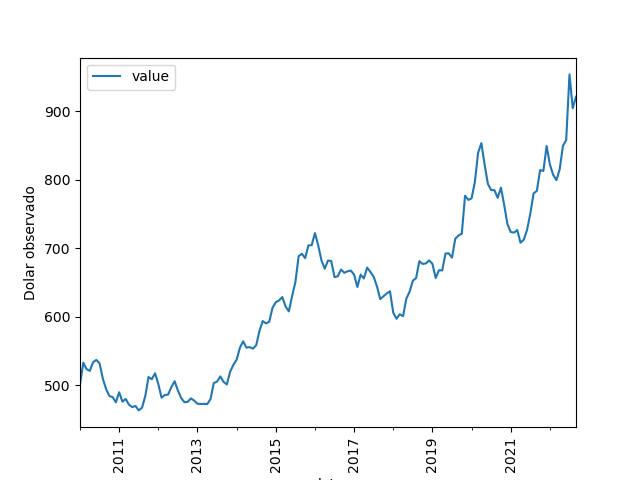
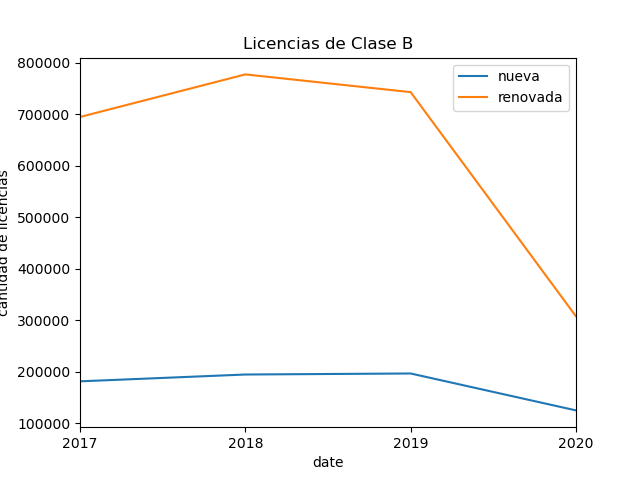

# Introducción

## Antecedentes, situación actual mercado automóvil

El `r mlm` desde el ultimo triestre del ano 2019 hasta segundo semestre del 2022 ma sufrido un aumento en la volatilidad en la ventas de `r k.lm`. La cuarta y quinta semanas del mes de actubre de 2019, las ventas fueron de 7.199 unidades, lo que se traduce en una baja de 50% en comparación con las mismas semanas de 2018. El inicio de la pandemia del COVID-19 a afectado reduciendo la venta de automóvil, el primer semestre del año 2020.

La figura \@ref(fig:vauto) presenta las ventas del mercado automotor de livianos y medianos, realizado por Asociación Nacional Automotriz de Chile (ANAC) desde enero 2019 hasta aguosto 2022.

En primera instancia en el gráfico se puede observar un valle debido a "principalmente, por el deterioro de las condiciones económicas a nivel internacional que han afectado a distintos mercados, no solo el automotriz, las cuales se han visto acrecentadas por las circunstancias políticas y económicas a nivel local"[^22], posterior debido al desconfinamiento progresivo a nivel nacional de ciertas comunas debida a la implementación del programa estatatal denominado **Paso a Paso**, Adicionalmente, el factor del retiro del 10% de las AFP ha demostrado un nivel de incidencia certero en la adquisición de bienes durables como los automóviles, lo que se sumaría a la recuperación del sector [^23]. Meses posteriores este mercado a visto una normalizacion en ventas con respecto al año movil. En consecuencia se espera un aumento en la demanda de los servicios de mantenimiento y reparación automotriz.

Para analisar el comportamiento del mercado automotor que este ultimo periodo fue afectado por las restricciones debido a las condiciones sanitarias de la Pandemia, no debemos solo limitarnos a la pandemia, otras variables que influyen en el mercado automotor y en los distintos mercados existento, el **dolar** y el **petroleo**, a continuacion se presenta el comportamiento del dolar observado como tambien del precio del petroleo (WIT).

El comportamiento de la demanda `r k.lm` puede ser determinada por la cantidad de licencias de conducion entregadas, debido a la restriccion de movilidad esta manifiesta un una baja en la entrega de documento, para este caso es relevante la **clase B** debido a que el cliente objetivo de `r nam`

